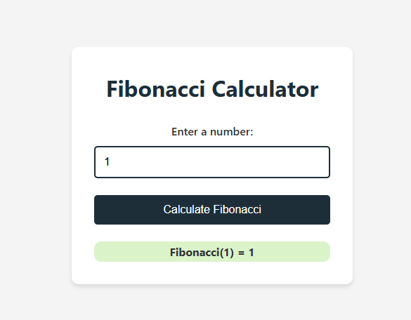
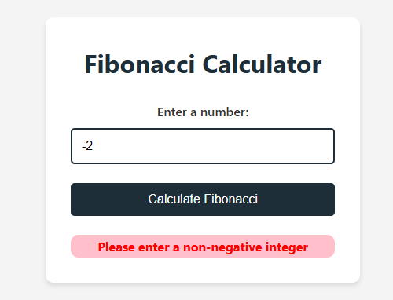
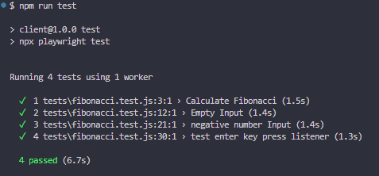
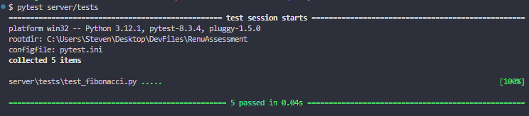

# Introduction

This is a Fibonacci application that uses Flask as the backend to serve JavaScript, CSS, and HTML files. The application allows users to calculate Fibonacci numbers and view the results on a web interface.

## Running the Application

### SetUp
-  Set up a virtual environment for Python at the root directory and activate it.
-  From the root directory, run `pip install -r server/requirements.txt`.
-  Navigate to the client folder by running `cd client` and then run `npm install` to get Playwright.

### Starting Application
-  From the root directory, run `python server/main.py` to start the application.
-  Go to `http://127.0.0.1:5000` to view the frontend application.

### Testing Fibonacci on Backend with Unit Tests
-  From the root directory, run `pytest server/tests`.

### Testing E2E tests on the frontend
-  From the root directory, navigate to the client folder by running `cd client`.
-  Run `npm run test`.

## How to set up a virtual environment:

### Creating a Venv (VS Code)
- Press `[ctrl]+[shift]+p` to enter the Command Palette.
- Type `Python: Create Environment`.
- Select `Venv`, then select your interpreter: `Python:3.XX` (I am using Python:3.12).

### Creating a Venv (CLI)
- Navigate to your project directory.
- Run `python -m venv .venv`.
- If you want IntelliSense, set up the path for your IDE.

## Images

### Frontend

### Frontend - Error

### E2E

### Pytest Unit Tests
